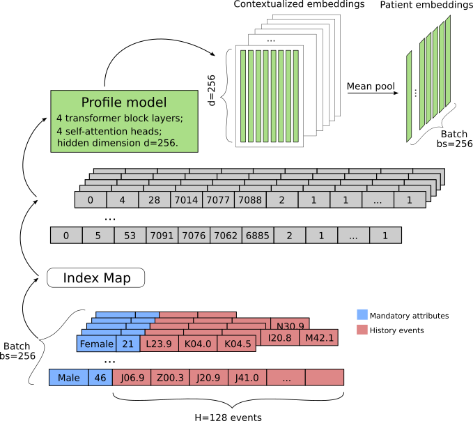

This code accompanies the paper <em>Medical Profile Model: Scientific and Practical Applications in Healthcare</em> by Pavel Blinov and Vladimir Kokh.



Some data preprocessing code is from https://github.com/xueping/MusaNet

### To run
- Check / install the dependencies:
```bash
pip install -r requirements.txt
```
- Open the ```mimic3.profile.ipynb``` notebook:
	- Set variable MIMIC_PATH;
	- Run all the cells.

### BibTeX reference
```

```

